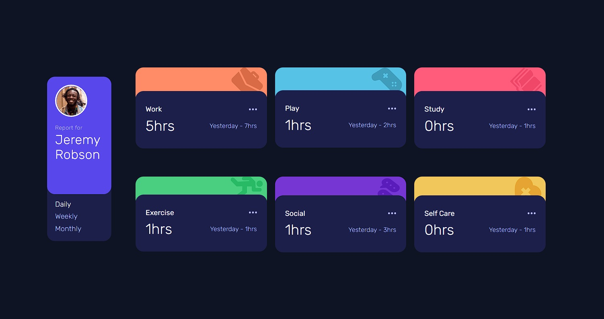

# Frontend Mentor - Time tracking dashboard solution

This is a solution to the [Time tracking dashboard challenge on Frontend Mentor](https://www.frontendmentor.io/challenges/time-tracking-dashboard-UIQ7167Jw). Frontend Mentor challenges help you improve your coding skills by building realistic projects. 

## Table of contents

- [Overview](#overview)
  - [The challenge](#the-challenge)
  - [Screenshot](#screenshot)
  - [Links](#links)
- [My process](#my-process)
  - [Built with](#built-with)
  - [What I learned](#what-i-learned)
- [Author](#author)
- [Acknowledgments](#acknowledgments)

## Overview

### The challenge

Users should be able to:

- View the optimal layout for the site depending on their device's screen size
- See hover states for all interactive elements on the page
- Switch between viewing Daily, Weekly, and Monthly stats

### Screenshot

### Links

- Solution URL: (https://www.frontendmentor.io/solutions/time-tracking-dashboard-javascript-vanilla-sass-gulp-8N_ZkDzrph)
- Live Site URL: (https://roonder-timetrackerapp.netlify.app/)

## My process

### Built with

- Semantic HTML5 markup
- CSS custom properties
- Flexbox
- CSS Grid
- Mobile-first workflow
- JavaScript ES6
- Gulp [https://gulpjs.com/] - Node.js Toolkit
- Node.js [https://nodejs.org/es/] - JavaScript Enviroment

### What I learned

In this project I played around a little bit with the different pages that you can do in a single website. Making use of the Fetch to be able to consume the JSON for dynamic data, using promises, functions and the use of a while loop to clean the HTML with the best performance possible.

## Author

- Website - [Roonder](https://github.com/Roonder)
- Frontend Mentor - [@roonder](https://www.frontendmentor.io/profile/Roonder)
- LinkedIn - [@roonderdev](https://www.linkedin.com/in/roonderdev/)

## Acknowledgments

I want to acknoledge my Udemy teacher, Juan De la Torre, because thanks to his good practices on JavaScript, I was able to improve on my code and my problem solving logic. Even though I have a lot more to learn, this was a really good project that I enjoyed, not only doing it, but also realizing my small progress.
